# ⚖️ Nemesis

**Détection de doublons MP3 et curation de bibliothèque musicale**, construite autour d'un principe simple : le **groupe de doublons est l'unité de travail**. Pas de liste passive de résultats — chaque groupe s'ouvre dans un panneau qui permet d'écouter, noter, garder/écarter, renommer, taguer et pousser vers Navidrome en un seul geste.

Nemesis (déesse grecque de l'équilibre et de la justice rétributive) rétablit l'ordre dans une bibliothèque musicale qui a accumulé des doublons au fil des imports, exports et ré-encodages.

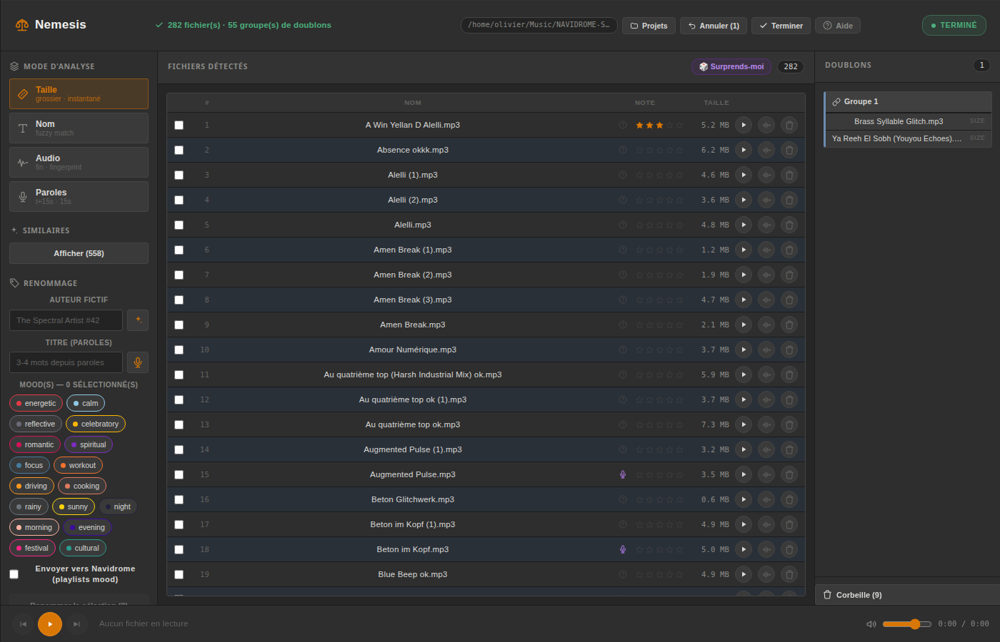

> **Plateforme : Linux only.** Développé et testé sur **Ubuntu 26.04 LTS**, avec Ollama et toutes les dépendances (Chromaprint, ffmpeg, faster-whisper, Essentia) installées localement. Non testé sur macOS/Windows — voir [Compatibilité](#compatibilité-macoswindows) pour le détail de ce qui casserait et pourquoi.
>
> Outil taillé sur mesure pour un seul setup (le mien) : ma bibliothèque MP3, mon Navidrome, mon Ollama local, mon Ubuntu. Si tu n'es ni moi ni l'une des deux autres personnes sur Terre à avoir exactement ce besoin, attends-toi à devoir bricoler.

## Pourquoi

Trier des centaines/milliers de MP3 à la main pour trouver les doublons — vrais doublons, quasi-doublons renommés, remixes, ré-encodages — est fastidieux. Nemesis automatise la détection via un **entonnoir progressif** (rapide → lent) et transforme chaque résultat en décision actionnable immédiatement, sans aller-retour entre plusieurs écrans.

## Fonctionnalités

### Détection en entonnoir (4 étapes, chacune affinant la précédente)
1. **Taille exacte** — instantané, détecte les copies parfaites
2. **Fuzzy match sur le nom** — distance de Levenshtein + clustering union-find sur tous les fichiers
3. **Empreinte audio** — Chromaprint (`fpcalc`) + distance de Hamming, détecte les ré-encodages/remasters
4. **Paroles** — transcription d'un extrait (t+15s, 15s — saute l'intro) via faster-whisper, similarité de Jaccard sur les mots

Chaque étape alimente aussi une vue **"Morceaux similaires"** avec seuil ajustable (80-95% par défaut), indépendante des seuils de clustering stricts.

### Score de confiance par groupe
Chaque groupe de doublons affiche un score de confiance (similarité de détection + concordance BPM/tonalité quand les deux fichiers sont analysés — concordant renforce, discordant affaiblit) pour prioriser les groupes les plus évidents plutôt que de traiter les 50+ groupes dans l'ordre du scan. Triable en un clic dans le panneau.

### Le groupe comme unité de travail
Cliquer un groupe de doublons ouvre un panneau unique : écoute inline, note 0-5 étoiles par fichier, cases garder/écarter, renommage (auteur fictif + titre depuis les paroles) et envoi vers Navidrome (mood + détection "déjà présent" → playlist Covers) — le tout dépilé en un clic "Appliquer".

### Projets persistants
Un dossier scanné devient un **projet durable** : toute action (quarantaine, renommage, envoi Navidrome, groupe ignoré) est journalisée et réversible via un **undo générique**. Un redémarrage du service reprend automatiquement le dernier projet actif. Sélecteur de projets avec suppression (métadonnées seulement, jamais les fichiers).

### Corbeille réversible, jamais destructive par défaut
Les fichiers écartés sont déplacés (jamais supprimés) vers une corbeille avec manifest — restaurables à tout moment. Une suppression physique existe mais nécessite une confirmation explicite en deux temps.

### Navigateur de répertoire serveur
Pas de picker OS : navigation qui détecte dynamiquement (via `/proc/mounts`) les points de montage locaux, clés USB, partages réseau (SMB/NFS) et autres montages.

### Sonogramme, trim & fade
Vue waveform (ffmpeg `showwavespic`) par fichier avec découpe du début/de la fin et fade in/out — réécrit le MP3 en place via ffmpeg, mais l'original est toujours sauvegardé à côté pour un undo complet.

### Fiche info complète
Nom, date de création, taille, note, BPM + tonalité (Essentia, calculé à la demande ou en masse via un bouton dédié) et **texte intégral des paroles transcrites**, avec possibilité de relancer la transcription à un offset différent (utile pour les morceaux à intro longue). Le BPM/tonalité est aussi écrit directement dans les tags ID3 (`TBPM`/`TKEY`) du fichier, pas seulement dans l'état de l'app.

### Colonnes triables, filtre par note, compteur d'écoutes
Colonnes Nom/BPM/Note/Taille triables en un clic. Filtre par note (0-5 étoiles, plusieurs actives à la fois) façon filmstrip Lightroom dans la barre de lecture. Chaque lecture incrémente un compteur d'écoutes affiché à côté de la fiche info — repère d'un coup d'œil les morceaux jamais écoutés.

### Sélection multiple façon Explorer/Finder
Clic = sélection exclusive, `Ctrl`/`Cmd`+clic = ajout/retrait individuel, `Maj`+clic = plage contiguë depuis le dernier fichier cliqué.

### Renommage rapide d'un seul fichier
Renommage inline (icône crayon sur la ligne) sans passer par le flux auteur/titre en masse — pour corriger un nom isolé sans configurer tout le panneau Renommage.

### Peintre (façon outil Painter de Lightroom)
Configure un ou plusieurs moods, une note et/ou un couple auteur+titre dans la barre du panneau, puis clique-glisse sur plusieurs fichiers pour les leur appliquer directement, sans repasser par le formulaire à chaque fichier.

### Panneau mood
Double-clic sur un mood dans la barre latérale ouvre son contenu réel, lu depuis la playlist Navidrome correspondante (pas une estimation locale) — avec une zone de dépôt pour glisser des fichiers dessus et les taguer localement en attendant l'envoi explicite.

### Sonogramme permanent dans la barre de lecture
Le sonogramme du morceau en cours est toujours visible en bas d'écran, avec une tête de lecture cliquable/glissable pour naviguer directement dedans. Les sonogrammes de tous les fichiers sont pré-générés en tâche de fond après chaque scan ou reprise de projet, pour un affichage instantané plutôt qu'un calcul ffmpeg à la demande.

### Comparateur A/B stéréo
Sélectionne deux fichiers pour les comparer à l'oreille : lecture synchronisée, un fichier exclusivement sur le canal gauche et l'autre sur le droit, mute indépendant par canal, crossfader façon table de mix DJ pour doser l'équilibre entre les deux. Une vue "diff" superpose les deux sonogrammes calés sur t=0 à la même échelle px/seconde pour repérer d'un coup d'œil une intro coupée, un outro en plus ou une durée différente, sans corrélation audio complexe.

### Historique d'annulation multi-niveaux
Au-delà du simple "annuler la dernière action" : un panneau liste l'historique complet des actions journalisées et permet d'annuler en rafale jusqu'à un point donné, pas seulement la toute dernière.

### Mode "Surprends-moi"
10 morceaux au hasard — priorité aux jamais-écoutés (via le compteur d'écoutes), complète avec le reste si moins de 10 inédits restent —, écoute + décision garder/quarantaine à la volée façon Tinder.

### Raccourcis clavier (façon Lightroom)
`0`-`5` note · `I` fiche info · `G`/`K` garder · `X`/`Q` quarantaine · `Espace` lecture/pause · `←`/`→` -10s/+10s · `↑`/`↓` morceau précédent/suivant · `Page ↑`/`Page ↓` navigue la liste · `Échap` ferme le panneau ouvert · `?` affiche l'aide. Liste complète accessible depuis le bouton **Aide** de l'interface.

### Intégration Navidrome
Push direct vers les playlists mood (taxonomie à 17 moods) avec détection des morceaux déjà présents dans la bibliothèque (routés vers une playlist Covers plutôt que dupliqués). Le mood route par appartenance à une playlist Navidrome, pas par genre ID3.

## Captures d'écran

| | |
|---|---|
| 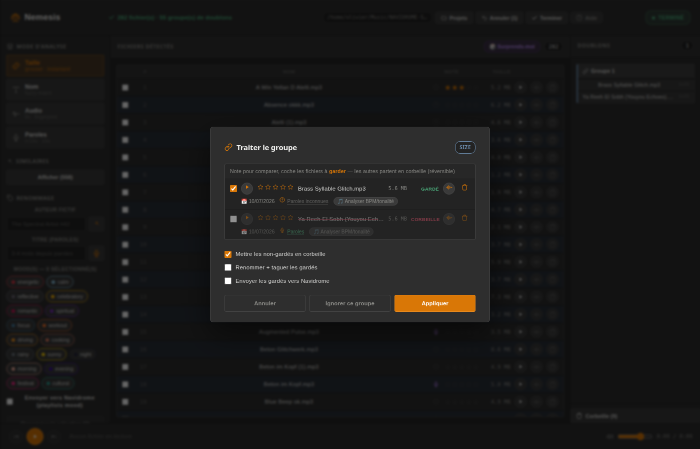 Panneau de groupe — écoute, note, garder/écarter, renommage, Navidrome | 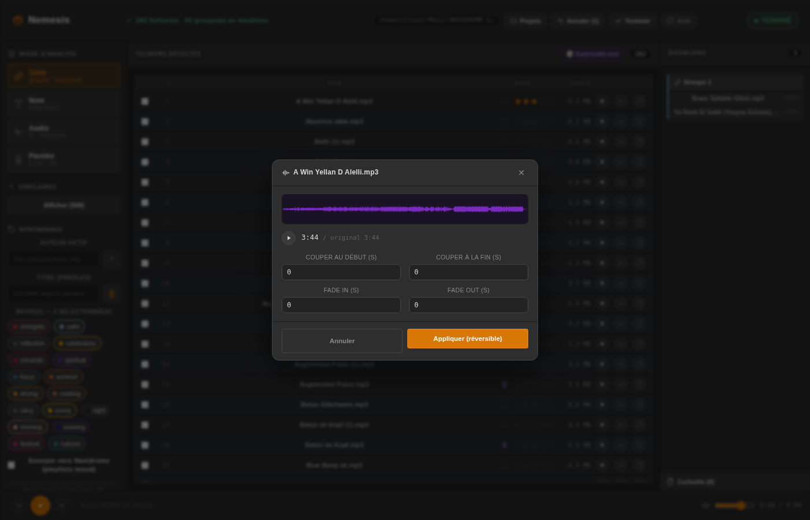 Sonogramme — trim & fade |
| 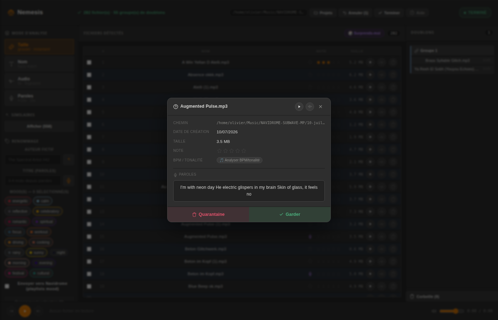 Fiche info — paroles complètes, bpm, tonalité | 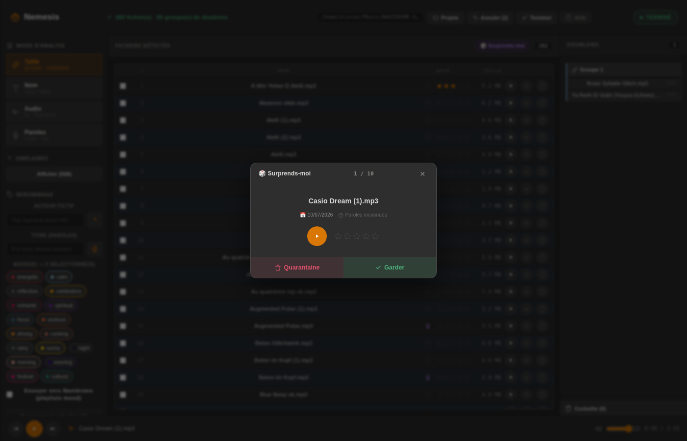 Mode Surprends-moi |
| 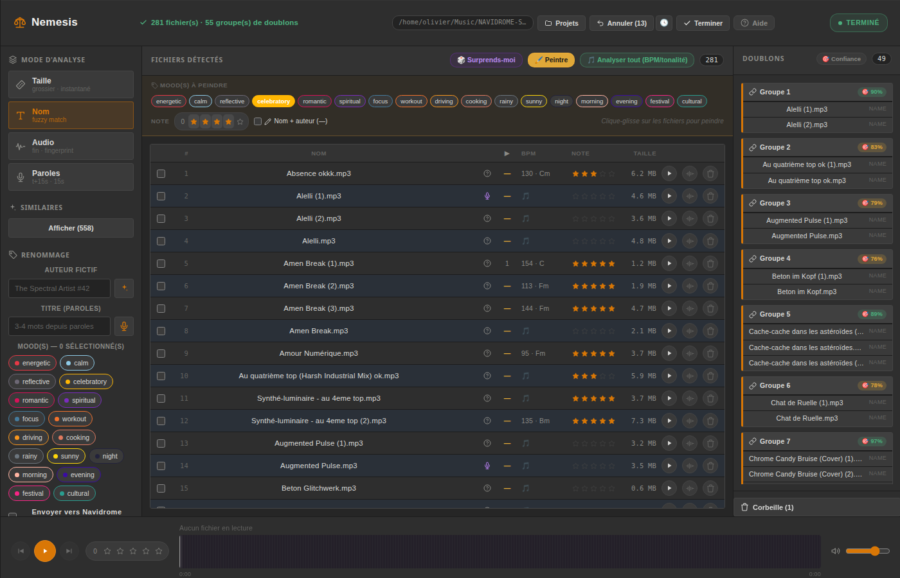 Peintre (façon Lightroom) + score de confiance des doublons | 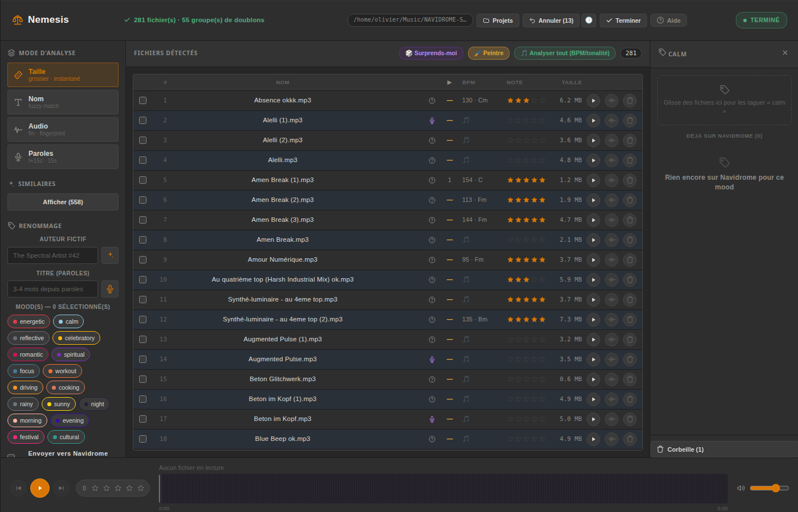 Panneau mood — contenu Navidrome réel + glisser-déposer |
| 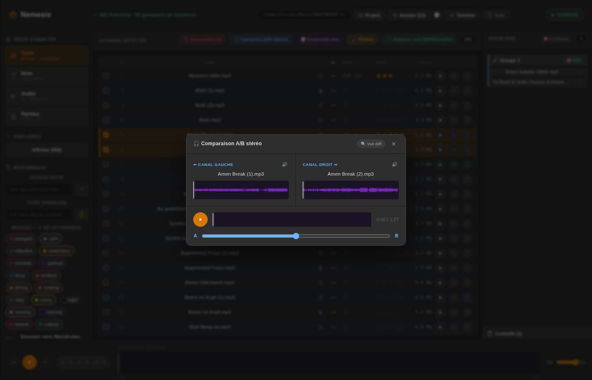 Comparateur A/B stéréo — mute par canal, crossfader DJ | 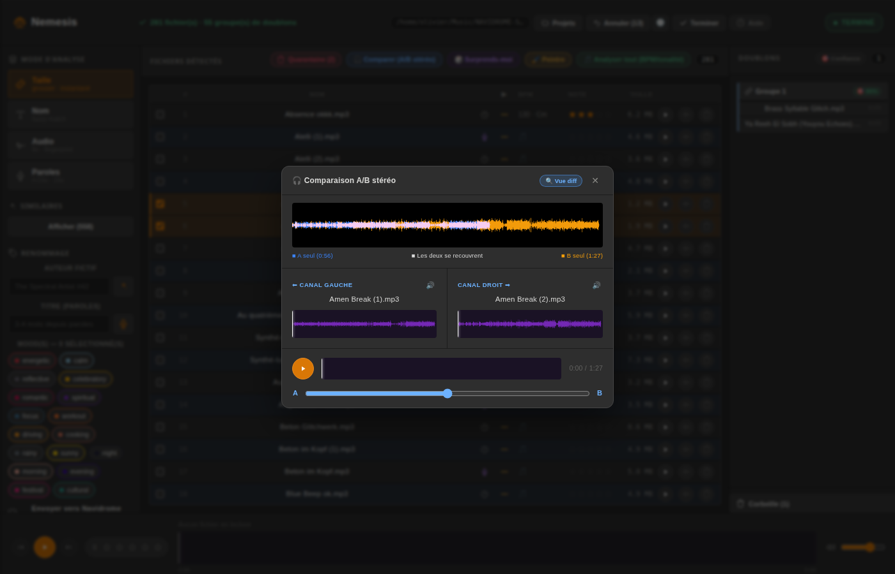 Comparateur A/B — vue diff des sonogrammes alignés |

Historique d'annulation multi-niveaux, sélection multiple et colonnes triables :

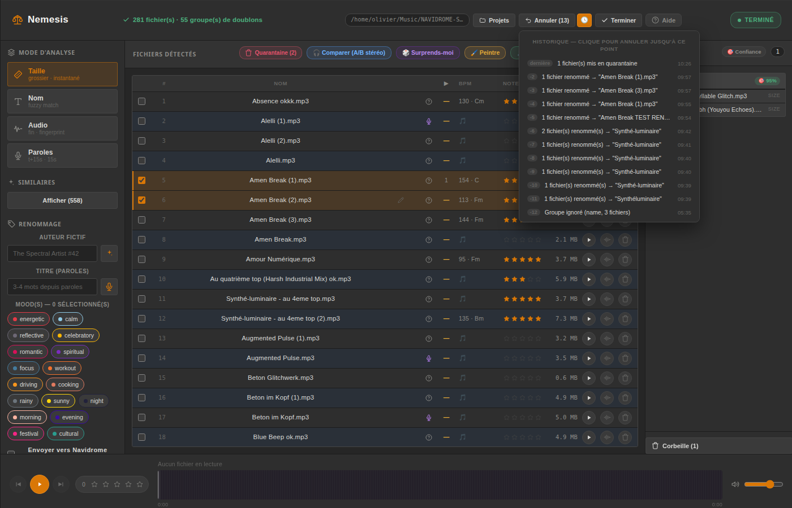

Aide et raccourcis clavier :

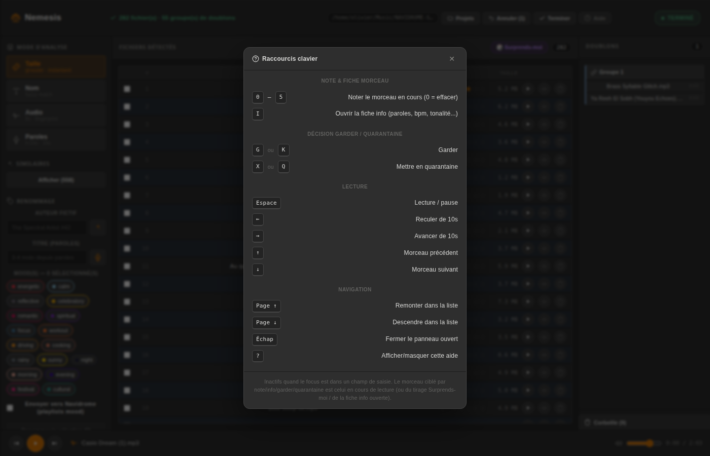

## Stack

- **Frontend** : React 19 + TypeScript + Vite
- **Backend** : Express 5 (ESM), process unique servant l'API et le frontend buildé
- **Persistance** : projets JSON (`~/.nemesis-projects/`) + cache SQLite (`better-sqlite3`) pour éviter de recalculer empreinte/paroles/bpm à chaque rescan
- **Audio** : Chromaprint (`fpcalc`), ffmpeg (trim/fade/waveform), faster-whisper (paroles), Essentia (BPM/tonalité)
- **Tags ID3** : `node-id3`
- **LLM** : Ollama local pour auteur fictif + titre depuis paroles

## Compatibilité macOS/Windows

Nemesis est développé et testé exclusivement sur **Ubuntu 26.04 LTS**. Le backend (Node/Express) est en soi multiplateforme, mais deux points cassent ou dégradent la fonctionnalité ailleurs :

- **Navigateur de répertoire — dégrade proprement.** L'auto-détection des clés USB/disques/partages réseau lit directement `/proc/mounts`, qui n'existe que sous Linux. Sur macOS/Windows, cet appel échoue silencieusement (try/catch, juste un `console.error`) et il ne reste que le raccourci "Accueil" — la navigation manuelle par chemin fonctionne toujours, rien ne plante.
- **BPM/tonalité (Essentia) — probablement indisponible sous Windows.** Essentia ne publie pas de wheel officiel Windows sur PyPI (Linux/macOS uniquement). Sans ce venv, l'étape est simplement ignorée (comme documenté plus bas) — pas de crash, mais pas de BPM/tonalité/tags `TBPM`/`TKEY` non plus.
- **macOS** : les autres dépendances (Chromaprint, ffmpeg, faster-whisper, Essentia) ont des builds officiels via Homebrew/pip — a priori plus proche de fonctionner nativement, mais non testé.
- **Windows natif** : non testé, prévoir des frictions (chemins, activation de venv `Scripts\` vs `bin/`, absence de systemd pour le déploiement). **WSL2** est le chemin le plus réaliste pour faire tourner Nemesis sur Windows.

Ollama (LLM pour auteur/titre fictifs) est optionnel sur toutes les plateformes — sans lui, les champs restent éditables manuellement, seul le bouton de génération automatique échoue proprement.

## Installation

### Dépendances système

```bash
sudo apt install libchromaprint-tools ffmpeg   # fpcalc + ffmpeg
```

### Environnements Python (paroles + BPM/tonalité)

Requis pour les étapes Paroles et BPM/tonalité, mais l'app dégrade proprement sans eux (étape simplement ignorée, pas de crash).

```bash
# Paroles — faster-whisper
python3 -m venv whisper-venv
./whisper-venv/bin/pip install faster-whisper

# BPM / tonalité — Essentia (chemin configurable via ESSENTIA_PYTHON)
python3 -m venv ~/essentia-venv
~/essentia-venv/bin/pip install essentia
```

### Application

```bash
git clone <repo-url> nemesis
cd nemesis
npm install
npm run build
```

## Configuration

Variables d'environnement (toutes optionnelles, avec fallback local) :

| Variable | Défaut | Usage |
|----------|--------|-------|
| `NAVIDROME_URL` | `http://localhost:4533` | Serveur Navidrome pour le push de playlists |
| `NAVIDROME_USER` | `admin` | Utilisateur Subsonic API |
| `NAVIDROME_PASS` | *(vide)* | Mot de passe Subsonic API — à définir |
| `NAVIDROME_LIBRARY_ROOT` | `/home/olivier/Music/NAVIDROME-SUBWAVE-MP` | Racine de la bibliothèque Navidrome (pour la détection "déjà présent") |
| `OLLAMA_URL` | `http://localhost:11434` | Ollama local pour auteur fictif / titre |
| `OLLAMA_MODEL` | `qwen2.5:7b` | Modèle Ollama utilisé |
| `ESSENTIA_PYTHON` | `~/essentia-venv/bin/python3` | Interpréteur Python du venv Essentia |
| `QUARANTINE_DIR` | `~/.nemesis-trash` | Corbeille réversible |
| `PROJECTS_DIR` | `~/.nemesis-projects` | Projets persistants + cache SQLite |

## Démarrage

**Développement** (hot reload frontend, proxy vers le backend) :
```bash
./dev.sh
```

**Production** — un seul process Express sert le frontend buildé et l'API sur le même port :
```bash
npm run build
node server.js
```
→ `http://localhost:5693`

## Tests

```bash
npm test
```

Deux niveaux : tests unitaires sur la logique de détection pure (`server/analysis.test.js` —
Levenshtein, fuzzy match, similarité d'empreinte/paroles, clustering union-find) et un parcours
E2E (`test/e2e.test.js`) qui lance le vrai process `node server.js` sur un dossier temporaire
avec de vrais MP3 générés via ffmpeg — scan, détection de doublons, quarantaine/undo,
renommage/undo, cycle de projet. Aucun mock : `fpcalc`/`ffmpeg` doivent être installés
(voir Installation ci-dessous).

## API (aperçu)

| Route | Description |
|-------|--------------|
| `POST /api/scan` | Lance/reprend le scan d'un dossier (funnel 4 étapes) |
| `GET /api/status` | État courant (polling temps réel) |
| `GET /api/projects` · `POST /api/projects/close` · `.../reopen` · `DELETE /api/projects` | Gestion des projets persistants |
| `POST /api/groups/skip` | Marque un groupe comme traité |
| `POST /api/undo` | Annule la dernière action journalisée (appelable en rafale pour remonter l'historique) |
| `POST /api/rename-bulk` | Renommage + tag ID3 en masse |
| `POST /api/rename-file` | Renommage simple d'un seul fichier |
| `POST /api/navidrome/push` | Envoi vers playlist(s) mood Navidrome |
| `GET /api/navidrome/mood/:mood` | Contenu réel d'une playlist mood Navidrome (pour le panneau mood) |
| `POST /api/tag-mood` | Tag/untag local d'un mood sur un ou plusieurs fichiers (peintre, glisser-déposer) |
| `POST /api/quarantine` · `GET /api/quarantine` · `.../restore` · `.../empty` | Corbeille réversible + suppression physique confirmée |
| `GET /api/stream/:encodedPath` | Streaming MP3 avec support HTTP Range (206) |
| `POST /api/rating` | Note 0-5 étoiles |
| `POST /api/play-count` | Incrémente le compteur d'écoutes d'un fichier |
| `POST /api/analyze-audio` | BPM/tonalité à la demande ou en masse (Essentia, mis en cache, écrit aussi en tags ID3) |
| `GET /api/waveform/:encodedPath` | Sonogramme PNG (mis en cache, pré-généré après scan) |
| `GET /api/waveform-diff` | Sonogrammes de deux fichiers alignés dans le temps pour comparaison visuelle A/B |
| `POST /api/audio-edit` | Trim + fade in/out (réversible) |
| `POST /api/lyrics-rescan` | Relance la transcription des paroles à un offset donné (bypass cache) |
| `GET /api/moods` | Liste des 17 moods canoniques |

## Déploiement (exemple systemd)

```ini
[Unit]
Description=Nemesis
After=network-online.target

[Service]
Type=simple
ExecStart=/usr/bin/node server.js
WorkingDirectory=/path/to/nemesis
Restart=on-failure
RestartSec=10
Environment=NAVIDROME_PASS=...

[Install]
WantedBy=multi-user.target
```

Un watchdog (timer systemd + `GET /api/status`) est recommandé pour redémarrer le service automatiquement en cas de blocage.

## Roadmap

- [ ] Support d'autres formats (FLAC, WAV, OGG)
- [x] Tests E2E
- [x] Parallélisation fingerprint (pool de workers `fpcalc`)
- [x] Suggestion de mood via Ollama (paroles/BPM → 1-3 moods)
- [x] Autopilot des groupes de doublons à haute confiance

## Licence

MIT
